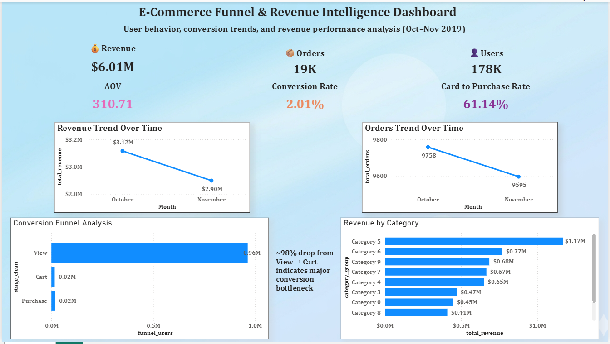

# 📊 E-Commerce Funnel & Revenue Intelligence Dashboard

## 🔍 Overview

This project analyzes e-commerce performance using user behavior data to uncover insights around revenue trends, conversion efficiency, and customer journey bottlenecks.

The dashboard focuses on identifying key drivers of revenue and major drop-off points in the user funnel.

## 🎯 Business Objective

To understand:

* How users interact with the platform
* Where conversion drop-offs occur
* Which product categories drive revenue
* How performance trends over time

## 📁 Dataset

* Source: Kaggle (E-commerce behavior dataset)
* Time Period: October–November 2019
* Tables Used:

  * Events (user interactions)
  * Orders (transactions)
  * Products (product details)

## 📌 Key Metrics

* **Total Revenue:** $6.01M
* **Total Orders:** 19K
* **Total Users:** 178K
* **Average Order Value (AOV):** $310.71
* **Conversion Rate:** 2.01%
* **Cart → Purchase Rate:** 61.14%

## 📊 Dashboard Components

### 🔝 KPI Cards

* Revenue, Orders, Users
* AOV, Conversion Rate, Cart-to-Purchase Rate

### 📈 Trends

* Revenue trend over time
* Orders trend over time

### 📦 Category Analysis

* Revenue contribution by product category

### 📉 Conversion Funnel

* View → Cart → Purchase journey
* Identifies drop-off points

## 🔍 Key Insights

* Revenue and orders declined from October to November
* Conversion rate is low (~2%), indicating inefficiency
* ~98% drop occurs between **View → Cart**
* Cart → Purchase conversion is strong (~61%)
* Revenue is concentrated in a few top categories

## 💡 Recommendations

* Improve product page experience (images, reviews, pricing clarity)
* Introduce offers or nudges to increase add-to-cart rate
* Optimize user journey before cart stage
* Diversify revenue across categories

## 🛠 Tools & Technologies

* Power BI (Dashboard & Visualization)
* SQL (Data Extraction & Transformation)
* Python (Data Processing - Pandas)

## 🚀 Project Outcome

This project demonstrates end-to-end data analysis:

* Data extraction
* Data modeling (Star Schema)
* KPI design
* Business storytelling

## 📁 Sample Data

Due to large dataset size (~13GB), a sampled dataset is provided for demonstration.

The full dataset is available on Kaggle:
[https://www.kaggle.com/datasets/mkechinov/ecommerce-behavior-data-from-multi-category-store]

## 📷 Dashboard Preview

